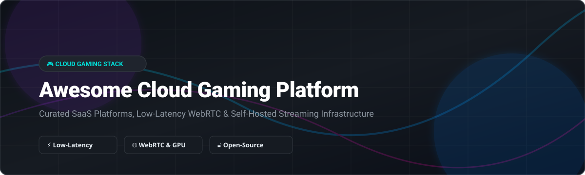

  
  
  
  
  

  

# 🎮 Awesome Cloud Gaming Platform

> **Curated Directory of SaaS Game Streaming Services, WebRTC Streaming Infrastructure & Open-Source Cloud Gaming Projects**
> 
> *Last updated: October 2026*

Welcome to the ultimate **SEO-curated list of Cloud Gaming Platforms, Game Streaming Software, and Self-Hosted Remote Play Tools**. Whether you are looking for commercial SaaS cloud gaming subscriptions (GeForce NOW, Xbox Cloud Gaming, PlayStation Plus, Amazon Luna) or building your own low-latency game streaming server using open-source tools (Sunshine, Moonlight, CloudMorph, Wolf), this repository covers the entire ecosystem.

---

## 📖 Table of Contents

- [☁️ SaaS & Commercial Cloud Gaming Platforms](#️-saas--commercial-cloud-gaming-platforms)
- [🔓 Open-Source Cloud Gaming & Game Streaming Projects](#-open-source-cloud-gaming--game-streaming-projects)
- [🤝 How to Contribute](#-how-to-contribute)
- [💖 Support & Sponsorship](#-support--sponsorship)
- [📈 Star History](#-star-history)
- [⚠️ Disclaimer](#-disclaimer)

---

## ☁️ SaaS & Commercial Cloud Gaming Platforms

> **📊 Market Context & Structure**: The global cloud gaming market is estimated at **~$8.5B in 2026**, growing toward **~$35B by 2032** at a **~26% CAGR** (Mordor Intelligence / MarketsandMarkets). The sector is **moderately concentrated** at the infrastructure tier — hyperscalers (NVIDIA, Microsoft, Amazon, Sony) dominate server distribution, while remaining **fragmented at the content & service tier**, allowing regional specialists (Boosteroid, Shadow PC, Blacknut) to compete on pricing and catalog breadth without a winner-take-all monopoly.

The table below is sorted by **Company Size / Valuation (Descending)**:

| Platform | Description | Pricing (Starting Tier) | Free Tier Limits | Company Size / Valuation 📈 |
|:---|:---|:---|:---|:---|
| **[GeForce NOW](https://www.nvidia.com/en-us/geforce-now/)** | NVIDIA's flagship cloud gaming platform streaming Steam, Epic Games, and PC libraries with RTX 5080 graphics. | **Performance**: **$9.99/month** (1440p, 6-hr sessions) . **Ultimate**: **$19.99/month** (4K, 8-hr sessions) | **Free tier**: **1-hour ad-supported sessions**, **1080p/60fps**, standard queue, 100-hour monthly cap | **~$3.5T Market Cap** (NVIDIA FY2026) |
| **[Xbox Cloud Gaming](https://www.xbox.com/cloud-gaming)** | Microsoft's cloud streaming service included with Game Pass Ultimate for Xbox, PC, mobile, and web browsers. | **Game Pass Ultimate**: **$19.99/month** (includes cloud streaming & 100+ titles) | **Ad-supported beta**: Stream owned games with **~2-min ads** & **1-hour session limit** | **~$3.3T Market Cap** / **$331.8B Rev** (Microsoft) |
| **[Amazon Luna](https://luna.amazon.com/)** | Amazon's web-based cloud gaming service featuring Luna+, Ubisoft+, Family, and Prime channel access. | **Luna Premium**: **$9.99/month** (Ubisoft+ & channels sold separately) | **Prime members**: Rotating selection of games at **no extra cost**; **7-day free trial** for Luna Premium | **~$2.0T Market Cap** / **$638B Rev** (Amazon) |
| **[PlayStation Plus Premium](https://www.playstation.com/en-us/ps-plus/)** | Sony's top-tier gaming subscription enabling cloud streaming for PS3, PS4, and select PS5 titles. | **Premium**: **$19.99/month** or **$159.99/year** | **No free tier** (Requires Premium subscription; **7-day free trial** in select regions) | **~$120B Market Cap** / **$30B Gaming Rev** (Sony) |
| **[Shadow PC](https://shadow.tech/)** | Full Windows cloud PC platform for high-end cloud gaming, 3D rendering, and software development. | **Shadow PC**: **$19.99/month** (starting configuration) | **No free tier** & **No free trial** (Paid subscription required from day 1) | **~$100M+ Raised** (Subsidiary of OVHcloud) |
| **[Blacknut](https://www.blacknut.com/)** | Family-focused French cloud gaming service providing unlimited access to 500+ curated games. | **Blacknut**: **$15.99/month** (unlimited multi-device streaming) | **30-day free trial** (Exclusive on select VIZIO OS smart TVs) | **~$20M+ Raised** (Private VC funded) |
| **[Boosteroid](https://boosteroid.com/)** | Independent cloud gaming platform offering broad PC title access with server locations across Europe and US. | **Ultra**: **€12.89/month** (€7.49/mo billed annually) . **Ultra Pro**: **€14.89/month** | **No free tier** (Requires active paid plan; connection latency testing free on website) | **~$10M+ Raised** (Private startup) |
| **[Antstream Arcade](https://www.antstream.com/)** | Retro game streaming platform featuring over 1,300 licensed retro classics and global tournament challenges. | **Monthly**: **~$4.99/month** (R$24.90) . **Yearly**: **~$20/year** (R$99.90) | **7-day free trial** (Available on annual subscription tier) | **~$10M+ Raised** (Private VC funded) |
| **[AirGPU](https://airgpu.com/)** | On-demand cloud GPU virtual machines built specifically for cloud gaming and graphics applications. | **STANDARD**: **$0.99/hour** . **ENTERPRISE**: **$1.49/hour** | **SHARED evaluation tier**: 1 workspace for non-production testing; **$600 trial credits** | **~$5M+ Raised** (Private bootstrapped/VC) |

---

## 🔓 Open-Source Cloud Gaming & Game Streaming Projects

Below is a curated list of open-source game streaming, WebRTC, and low-latency self-hosting projects, sorted by **GitHub Star Count (Descending)**.

| Project Name & Description | GitHub Stars 🌟 |
|:---|:---|
| ☀️ **[Sunshine](https://github.com/LizardByte/Sunshine)** — **The de facto open-source self-hosted game streaming server.** Features low-latency hardware encoding for AMD, Intel, and NVIDIA GPUs. Integrates seamlessly with Moonlight clients on any device. GPL-3.0. |  |
| 🌙 **[Moonlight Qt](https://github.com/moonlight-stream/moonlight-qt)** — **Open-source NVIDIA GameStream & Sunshine client** for Windows, macOS, Linux, and Steam Deck. Delivers up to 4K 120 FPS HDR low-latency video streaming. GPL-3.0. |  |
| 📱 **[Moonlight Android](https://github.com/moonlight-stream/moonlight-android)** — Open-source Moonlight game streaming client for Android smartphones, tablets, Android TV, and NVIDIA Shield devices. |  |
| 🚀 **[CloudMorph](https://github.com/giongto35/cloud-morph)** — **Decentralized, self-hosted Windows application & cloud gaming platform.** Browser-based streaming powered by Docker containers, WebRTC, and Go. Includes OpenEnv RL environment support. |  |
| 🐺 **[Wolf](https://github.com/games-on-whales/wolf)** — **Kubernetes-native game streaming infrastructure.** Isolates and streams multiple desktop/game instances in Docker containers with hardware acceleration. Designed for multi-tenant cloud gaming. MIT. |  |
| 🕹️ **[CloudRetro](https://github.com/giongto35/cloud-game)** — Open-source WebRTC cloud gaming server for retro games. Play classic console games directly in your browser with multi-player support and zero client install. MIT. |  |
| 📹 **[Selkies-GStreamer](https://github.com/selkies-project/selkies-gstreamer)** — Open-source WebRTC high-performance GPU application streaming platform powered by GStreamer. Designed for cloud gaming and remote desktop workloads. |  |

---

## 🤝 How to Contribute

Contributions are always welcome! 

1. 🍴 **Fork** the repository.
2. 📝 **Add or update** entries in `README.md` following the table schema.
3. 🔗 Ensure all links lead to official sites or verified GitHub repositories.
4. 🚀 Submit a **Pull Request** with a brief summary of changes.

---

## 💖 Support & Sponsorship

If you find this repository helpful for discovering cloud gaming services or building self-hosted game streaming infrastructure, please consider supporting the project!

- ⭐ **Star this repository** to show your appreciation.
- 🔀 **Fork & share** it with fellow gamers, self-hosters, and cloud engineers.
- ☕ **Buy me a coffee / Sponsor**: Support ongoing maintenance via [GitHub Sponsors](https://github.com/sponsors/ishandutta2007).

  

---

## 📈 Star History

---

## ⚠️ Disclaimer

- This is a community-curated collection intended for educational and research purposes.
- All trademarks, logos, and brand names belong to their respective owners.
- Cloud gaming services handle user credentials and streaming data; ensure appropriate network security when self-hosting.
- Pricing and free tier terms are subject to change by respective providers.

---

  Maintained with ❤️ for the global gaming &amp; open-source developer community.
   
  Part of the <a href="https://github.com/ishandutta2007/Awesome-Awesome-Awesome">Awesome-Awesome-Awesome</a> collection.

